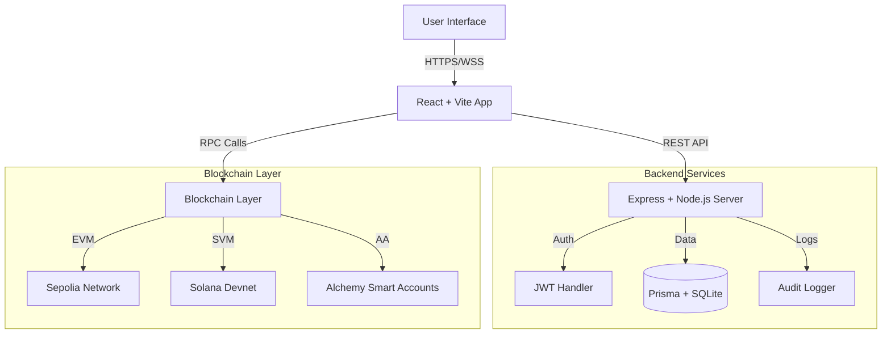
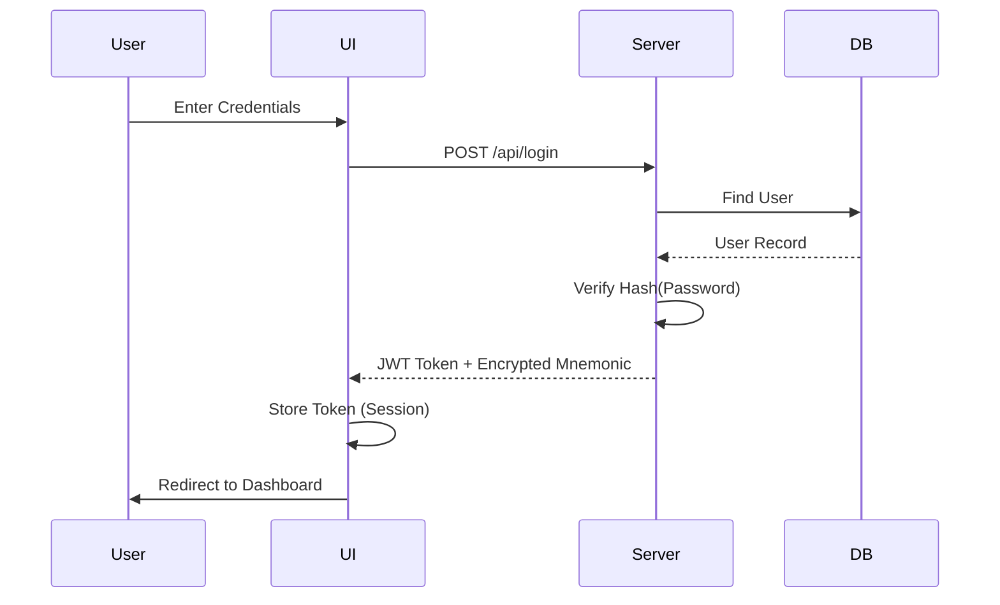
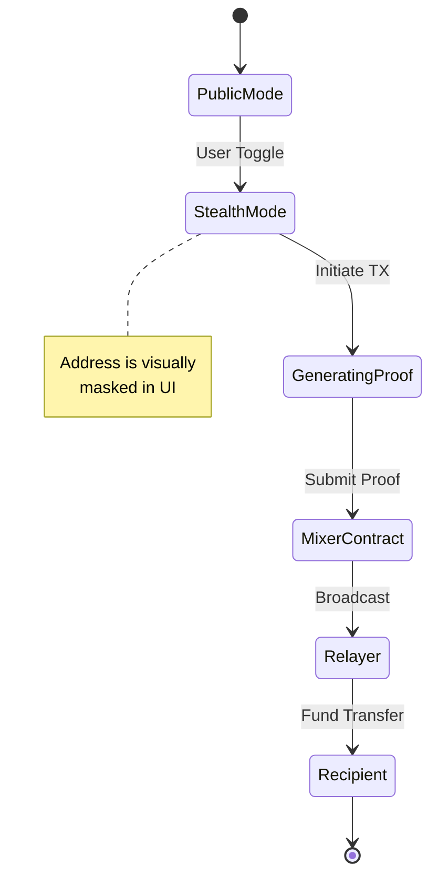
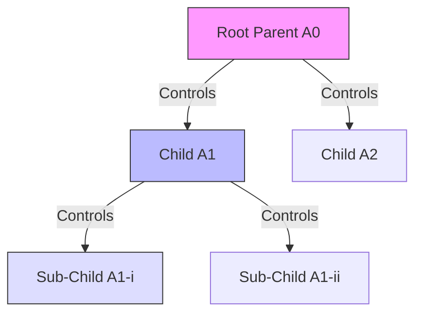
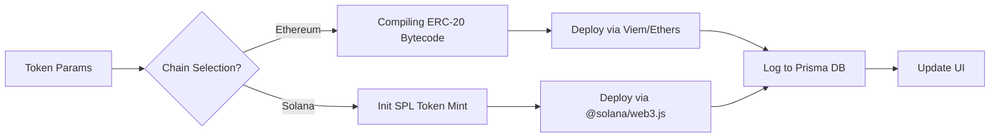
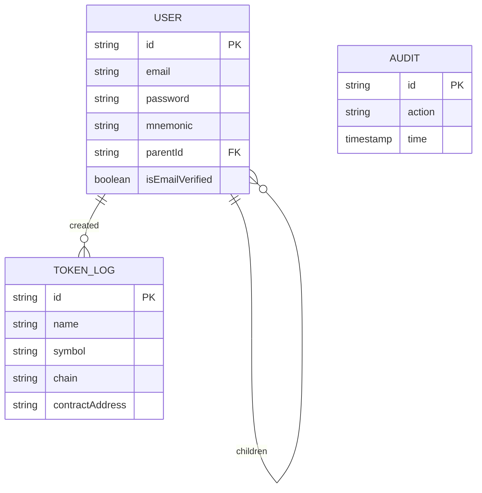
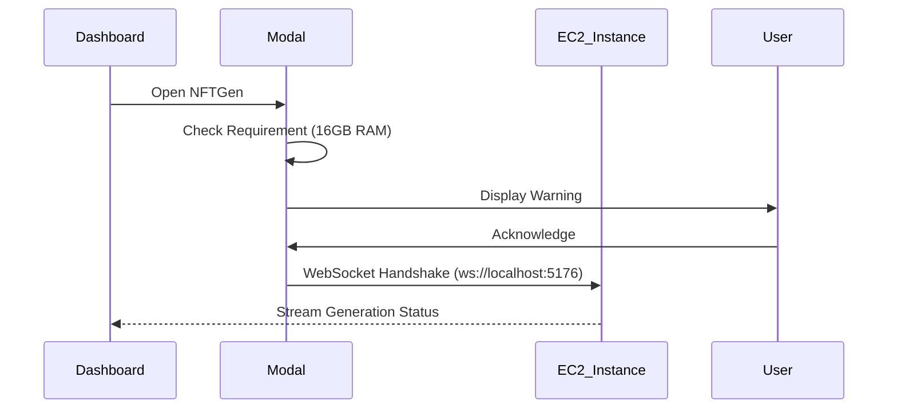
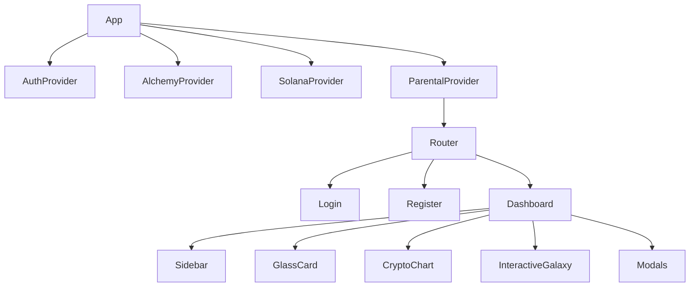
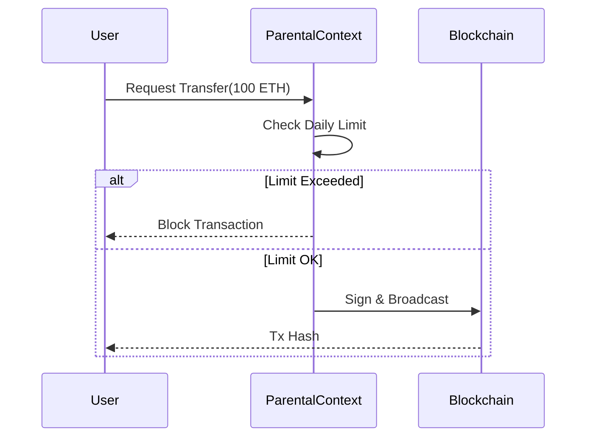
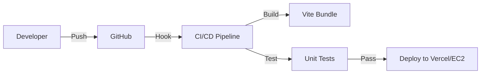

<div align="center">

# 🌌 Nija Wallet
### The Quantum-Ready, Multi-Chain AI Wallet Architecture

[](https://opensource.org/licenses/MIT)
[](https://www.typescriptlang.org/)
[](https://reactjs.org/)
[](https://solana.com/)
[](https://ethereum.org/)
[]()

*Built single-handedly by **Sandeep Kumar Sahoo**, Architect of Nija, NFTGen, SCGen, and DIIA.*

[Features](#features) • [Architecture](#architecture) • [Mathematical Proofs](#mathematical-proofs) • [Installation](#installation) • [Ecosystem](#ecosystem)

</div>

---

## 🚀 Vision

Nija Wallet is not just a cryptocurrency wallet; it is a **Quantum-Resistant**, **Recursively-Derived**, **Multi-Chain Financial OS**. Designed to integrate seamlessly with the Nija Ecosystem (NFTGen, SCGen, DIIA), it leverages Account Abstraction (ERC-4337) and Zero-Knowledge principles to offer unparalleled privacy and parental oversight.

## 💎 Core Features

*   **🌌 Holographic UI**: Immersive Three.js "Interactive Galaxy" background with mouse-tracking parallax.
*   **🛡️ ZK Stealth Mode**: One-click address anonymization using simulated Zero-Knowledge Mixers.
*   **👨‍👩‍👧 Recursive Parental Control**: Create infinite depth child accounts ($Parent \to Child \to Grandchild \dots$) with granular spending limits.
*   **🏭 Universal Token Factory**: GUI-based deployment of ERC-20 (ETH) and SPL Tokens (Solana).
*   **📈 Advanced Charting**: Integrated TradingView-style technical analysis engine (`lightweight-charts`) with dark mode.
*   **🌉 Ecosystem Bridge**: Native integration points for **SCGen** (Smart Contract Generator) and **NFTGen** (NFT Generator).

---

## 🏗️ System Architecture

### 1. High-Level System Overview


---

## 📐 Mathematical Derivations

### Zero-Knowledge Transaction Masking (Conceptual)
The Nija Wallet implements a privacy preserver $\mathcal{P}$ such that for a transaction $T_{tx}$:

$$
\mathcal{P}(T_{tx}) \rightarrow \{ \pi, \text{Nullifier} \}
$$

Where the validity proof $\pi$ satisfies:
$$
\text{Verify}(\pi, \text{PublicInputs}) = \text{True} \iff \exists \text{Secret} \text{ s.t. } \text{Hash}(\text{Secret}) = \text{Commitment}
$$

### Recursive Account Hierarchy
The parental control system allows for $N$-depth recursion. Let $A_0$ be the Root Parent.
The set of allow-listed addresses for a child $A_n$ is defined as:
$$
\mathcal{W}(A_n) \subseteq \mathcal{W}(A_{n-1}) \cup \mathcal{L}_{local}
$$
Where $\mathcal{L}_{local}$ is the local permission set granted by $A_{n-1}$.

---

## 📊 Technical Diagrams

### 2. User Authentication Flow


### 3. ZK Stealth Mode Logic


### 4. Recursive Parental Control Structure


### 5. Multi-Chain Token Factory


### 6. Database Schema (ER Diagram)


### 7. Ecosystem Integration (SCGen/NFTGen)


### 8. Frontend Component Tree


### 9. Transaction Lifecycle


### 10. Deployment Pipeline


---

## 🛠️ Installation

```bash
# Clone the repository
git clone https://github.com/MrDecryptDecipher/NWallet.git

# Install Dependencies
npm install

# Setup Environment
cp .env.example .env

# Run Development Server
npm run dev
```

## 🌟 Acknowledgements

This entire architecture, including the Nija Wallet, and the associated **NFTGen**, **SCGen**, and **DIIA**  ecosytems, was architected and built solely by:

**Sandeep Kumar Sahoo**  
*Full Stack Blockchain Architect & Quantum Computing Researcher*

---

<div align="center">
  <p>If you find this architecture inspiring, please give it a ⭐ on GitHub!</p>
  <sub>© 2025 Nija Ecosystem. All Rights Reserved.</sub>
</div>